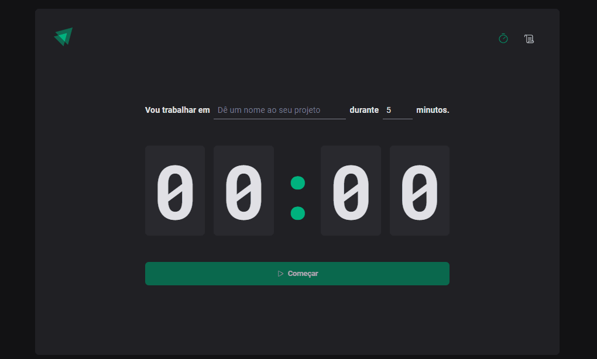
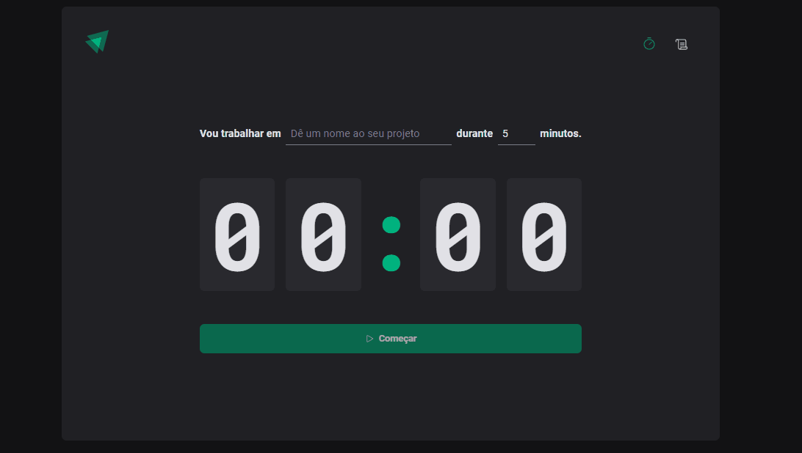
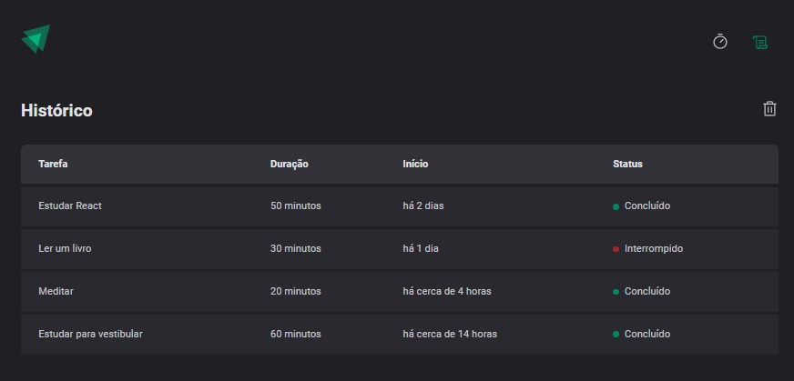
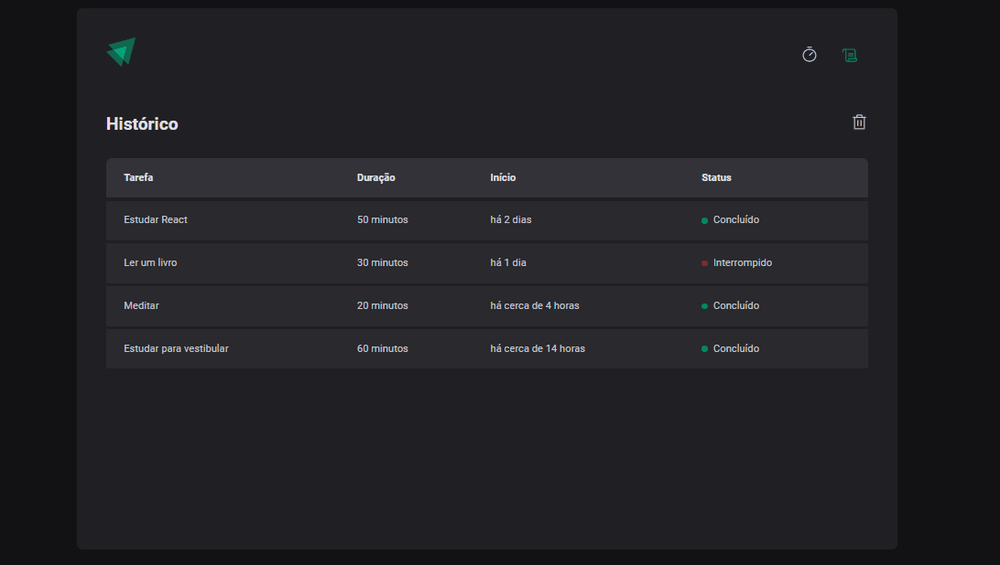
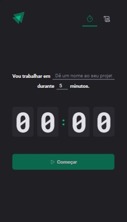
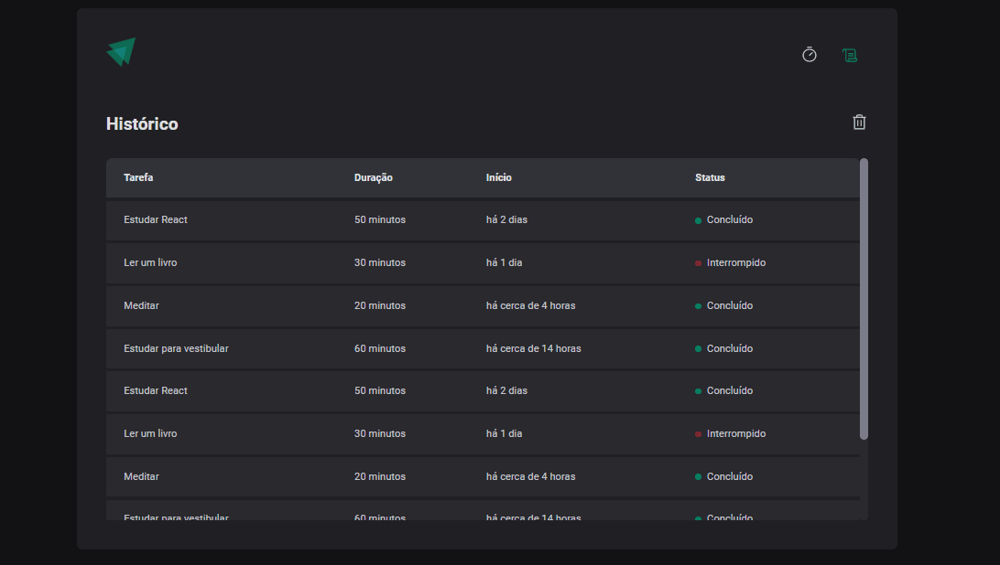
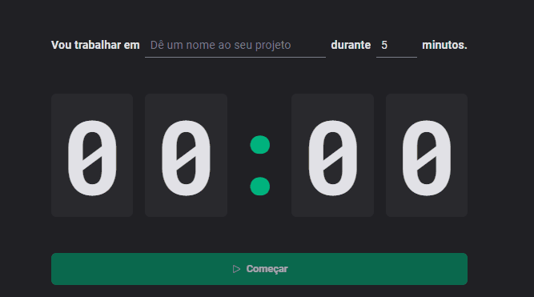

# Timer Pomodoro

Um Timer Pomodoro construido durante a trilha de React Js do curso Ignite da Rocketseat.



## 🚀 Começando

Essas instruções permitirão que você obtenha uma cópia do projeto em operação na sua máquina local para fins de desenvolvimento e teste.

### 📋 Pré-requisitos

```
Node Js instalado na máquina.
```

### 🔧 Instalação

Primeiramente faça o download do projeto em sua máquina.

Instale as dependencias:

```
npm install
```

Para rodar a aplicação:

```
npm run dev
```

Após isso, insira o endereço informado em seu navegador, ex: http://localhost:5173/

<br>
<br>

## Funcionalidades

A aplicação é dividida em duas páginas: 
* Home, onde fica o formulário e o timer, 


* History, onde fica o histórico de tarefas.



### Novas funcionalidades e correção de bugs

Inseri novas funcionalidades a aplicação, além de corigir alguns bugs que ficaram.

* Limpar o histórico de tarefas, na aplicação original não havia esta opção.



* Responsividade, anteriormente a aplicação não podia ser utilizada em dispositivos mobile.



* Scrollbar personalizada, antes havia um overflow da lista pra fora da div.



* Exibição da tarefa e tempo em execução, ao invés do formulário em branco.



<br>
<br>

## 🛠️ Construído com

* React
* TypeScript
* Vite
* Styled Components

### 📚 Bibliotecas utilizadas

* React-hook-form
* React-router-dom
* date-fns
* Zod
* localStorage
* Eslint


